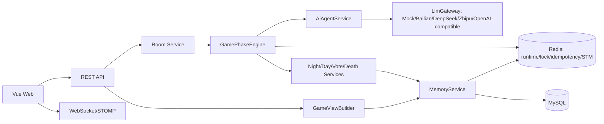

# AI Werewolf / AI 狼人杀


AI Werewolf 是一个 Java 21 + Spring Boot + Vue 3 的多 Agent 狼人杀项目。它支持真人参与、真人观战、真人和 AI 混合对局，以及默认无需 API Key 的全 AI 自动对局。

## 项目亮点

- 多 Agent：每个 AI 玩家拥有独立角色、视角、记忆和策略。
- 信息隔离：所有外部输出由 `GameViewBuilder` 构建，禁止把完整真相直接给普通玩家或 AI。
- 角色 Prompt：每个角色都有独立系统提示词，位于 `server/src/main/resources/prompts/roles/`。
- 实时游戏：REST 恢复状态，WebSocket/STOMP 推送阶段、时间线和公共事件。
- AI Infra：多模型网关支持 Mock、百炼、DeepSeek、智谱和通用 OpenAI-compatible Provider；`AgentRun` 记录模型输入输出和 fallback，`AgentTask` 持久化 Worker 任务状态，`GameEvent` 支持公开和 GodView 回放。
- 前端操作：游戏桌支持玩家发言、投票、夜间行动；GodView 展示身份、AgentRun、AgentTask 和事件回放。
- 可开源：默认 Mock LLM，真实密钥只从环境变量读取。
- 可扩展：角色能力接口、状态机、记忆作用域和默认模板均可继续扩展。

## 技术栈

后端：Java 21、Spring Boot 3、Maven、MySQL 8、Redis、Spring Data JPA、Flyway、WebSocket/STOMP、JUnit 5、Mockito。  
前端：Vue 3、TypeScript、Vite、Pinia、Vue Router、Axios、STOMP。

## 架构



## 快速开始

```bash
cp .env.example .env
docker compose -f docker-compose.example.yml up -d
mvn spring-boot:run -pl server
```

`docker-compose.example.yml` 会启动 MySQL 和 Redis。MySQL 保存长期事实和审计记录；Redis 用于运行态缓存、阶段推进锁、幂等键和 Agent 短期记忆。未启动 Redis 时，本地开发会自动降级到 JVM 内存，不影响基础启动和测试。

前端：

```bash
cd web
cp .env.example .env.local
npm install
npm run dev
```

访问 `http://localhost:5173` 创建房间。默认模板支持 7 人、9 人、12 人局；7 人局优先保证完整链路。

## 配置安全

请不要将 .env、application-local.yml、application-prod.yml、真实数据库密码、真实 LLM API Key、Token 或任何本地私有配置提交到 GitHub。项目已提供 .env.example 和 application-*.example.yml 作为模板配置文件。

默认 `LLM_PROVIDER=mock`，未配置真实 API Key 也可以运行。真实模型统一走后端 `LlmGateway`，前端不会直接接触模型 API Key。

启用阿里百炼：

```env
LLM_PROVIDER=bailian
BAILIAN_API_KEY=your_key
BAILIAN_BASE_URL=https://dashscope.aliyuncs.com/compatible-mode/v1
BAILIAN_MODEL=qwen-plus
```

启用 DeepSeek：

```env
LLM_PROVIDER=deepseek
DEEPSEEK_API_KEY=your_key
DEEPSEEK_BASE_URL=https://api.deepseek.com
DEEPSEEK_MODEL=deepseek-chat
```

启用智谱：

```env
LLM_PROVIDER=zhipu
ZHIPU_API_KEY=your_key
ZHIPU_BASE_URL=https://open.bigmodel.cn/api/paas/v4
ZHIPU_MODEL=glm-4-flash
```

接入其他 OpenAI-compatible 平台：

```env
LLM_PROVIDER=openai-compatible
OPENAI_COMPATIBLE_API_KEY=your_key
OPENAI_COMPATIBLE_BASE_URL=https://api.example.com/v1
OPENAI_COMPATIBLE_MODEL=your-model
```

## API 示例

```bash
curl -X POST http://localhost:8080/api/rooms \
  -H 'Content-Type: application/json' \
  -d @docs/examples/create-room-7.json
```

主要接口见 [docs/api.md](docs/api.md)。WebSocket 入口为 `/ws/game`，公共频道为 `/topic/rooms/{roomId}/public`。

创建房间响应会返回一次性的 `godViewToken`。前端会保存到本地并通过 `X-God-View-Token` 请求头访问 GodView；普通请求不再支持 `?god=true`。

全 AI 观战可调用 `POST /api/rooms/{roomId}/simulate` 一键模拟到游戏结束；真人参与时，`/auto-advance` 会停在真人当前角色真正能操作的阶段。

## 默认模板

- 7 人标准局：狼人 2、平民 3、预言家 1、女巫 1。
- 9 人标准局：狼人 3、平民 3、预言家 1、女巫 1、猎人 1。
- 12 人进阶局：狼人 3、狼王 1、平民 4、预言家 1、女巫 1、猎人 1、守卫 1。
- 12 人复杂局：白狼王模板预留。

## 测试

```bash
mvn test
cd web && npm run build
```

CI 默认使用 Mock LLM，不依赖真实密钥。

## Roadmap

- 多真人联机权限系统。
- 更完整的复杂角色结算。
- 回放系统和对局报告。
- Redis Stream / MQ 式 Agent Worker 投递层。
- 排行榜和 Agent 个性编辑器。
- 移动端深度适配。

## 文档

- [API](docs/api.md)
- [游戏规则](docs/game-rules.md)
- [信息隔离](docs/memory-isolation.md)
- [Agent 设计](docs/agent-design.md)
- [配置说明](docs/configuration.md)

## 贡献与协议

本项目使用 MIT License。
